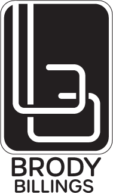

  

# AV Research Assignment
## By Brody Billings

 

This is the submission file for Brody Billings AV Research app. This file is based off our team page allowing for the content between the header and footer to be dynamic based on the route that is selected
 

A brief summary. This is more complex build than the other but features node routing to the secondary pages for both audio and video accesibilities. The Audio page features a transcription that the user can toggle on and off with a large button or download a text file version of it. The video page features a toggle button for large video control buttons, closed captioning and subtitles for the video with audio.

The overall site has aria tags for screen readers in areas where something may not be 100% clear or could use more information.

Feel free to look at this [Google Docs](https://docs.google.com/document/d/10dlVxhMgElGhbLxynEFAVA6G9BBX4jkN0Ojns-e-QTI/edit?usp=sharing) file for planning and problem solving

## Installation
***
### ` To run`
1. Download the file and unzip/clone 
2. Open in your coding program of choice (Visual Studio Code Recommended)
3. In the package.json download all the dependencies needing using you terminal/bash window
- npm install
- npm install node
- npm install express 
- Handlebars
4. After everything is installed run npm start in a terminal/bash window pointing at the file 
5. open a browser and navigate to localhost:3000
6. Have fun playing with an accessible website

## Contributing
***

1. Fork it!
2. Create your feature branch: `git checkout -b my-new-feature`
3. Commit your changes: `git commit -am 'Add some feature'`
4. Push to the branch: `git push origin my-new-feature`
5. Submit a pull request :D

 

## Credits
***

JS help from in class demonstrations and previous assignments.
 
Accessibility Help [WAVE](https://chrome.google.com/webstore/detail/wave-evaluation-tool/jbbplnpkjmmeebjpijfedlgcdilocofh)
 
Accessibility Help [MDN](https://developer.mozilla.org/en-US/docs/Web/Accessibility)

## License
***
MIT